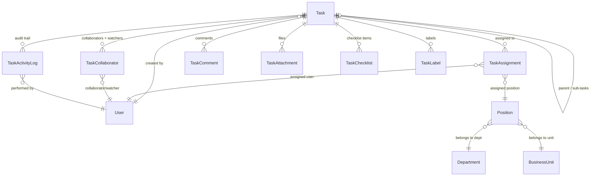
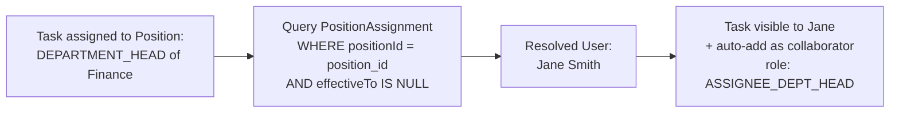
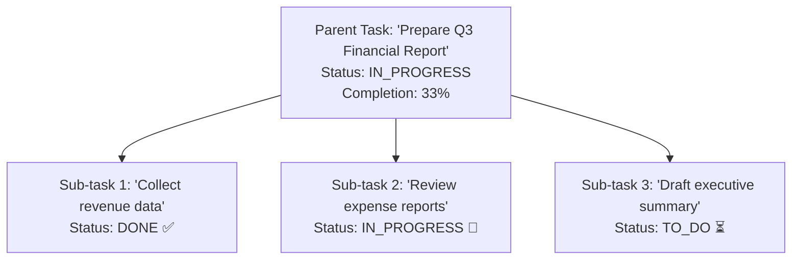

# Task Schema Redesign — Design Document

**Version**: 1.0.0
**Last Updated**: 2026-06-18
**Status**: Approved
**Owner**: Engineering Team
**Depends On**: `03-task-management-prd.md`, `08-database-design.md`, `05-org-and-access-control-design.md`

---

## 1. Overview

This document describes the redesign of the Task module database schema to support:

1. **Multi-assignment** — Tasks can be assigned to multiple users and/or positions simultaneously
2. **Position-based assignment** — Assign to a department head, unit head, manager, etc. via the Position model
3. **Reassignment with audit trail** — Full history of all task changes via `TaskActivityLog`
4. **Collaboration & visibility** — Contributors, reviewers, and auto-added watchers (dept heads) in a single `TaskCollaborator` model
5. **Sub-tasks** — Self-referential parent/child tasks with parent completion depending on sub-task completion
6. **Attachments, checklists, labels** — Standard task management features

This supersedes the original inline assignee design in `08-database-design.md` §3.6.

---

## 2. Architecture

### 2.1 ER Diagram



### 2.2 Schema File

All new models reside in `prisma/schema/tasks.prisma`. Existing models in `auth.prisma`, `org.prisma`, and `platform.prisma` require relation updates (see §7).

---

## 3. New & Updated Enums

| Enum | Values | Notes |
|------|--------|-------|
| `task_assignee_type` | `USER`, `POSITION` | **Changed** — removed `DEPARTMENT`, `BUSINESS_UNIT`. Dept/unit heads are now assigned via their Position. |
| `task_assignment_status` | `ACTIVE`, `REASSIGNED`, `REVOKED` | **New** — tracks lifecycle of each assignment row |
| `task_collaborator_role` | `CONTRIBUTOR`, `REVIEWER`, `OBSERVER`, `ASSIGNER_DEPT_HEAD`, `ASSIGNEE_DEPT_HEAD`, `ASSIGNEE_UNIT_HEAD` | **New** — merges watcher and collaborator roles |
| `task_activity_type` | `CREATED`, `ASSIGNED`, `REASSIGNED`, `UNASSIGNED`, `STATUS_CHANGED`, `PRIORITY_CHANGED`, `COLLABORATOR_ADDED`, `COLLABORATOR_REMOVED`, `COMMENT_ADDED`, `ATTACHMENT_ADDED`, `ATTACHMENT_REMOVED`, `CHECKLIST_UPDATED`, `DUE_DATE_CHANGED`, `SUB_TASK_ADDED`, `SUB_TASK_REMOVED`, `CUSTOM` | **New** — event types for the activity log |
| `task_type` | `NORMAL`, `WORKFLOW` | Unchanged |
| `task_status` | `TO_DO`, `IN_PROGRESS`, `DONE`, `CANCELLED`, `ON_HOLD` | Unchanged |
| `task_priority` | `LOW`, `MEDIUM`, `HIGH`, `CRITICAL` | Unchanged |
| `task_frequency` | `DAILY`, `WEEKLY`, `MONTHLY`, `YEARLY` | Unchanged |

---

## 4. Table Reference

### 4.1 `tasks` (Modified)

| Column | Type | Constraints | Notes |
|--------|------|-------------|-------|
| id | uuid | PK | |
| tenant_id | uuid | FK → tenants (CASCADE) | |
| parent_task_id | uuid? | FK → tasks (self-ref) | **New** — sub-task support |
| title | varchar | NOT NULL | |
| description | text | | |
| task_type | task_type (enum) | DEFAULT 'NORMAL' | |
| status | task_status (enum) | DEFAULT 'TO_DO' | |
| priority | task_priority (enum) | DEFAULT 'MEDIUM' | |
| frequency | task_frequency (enum) | | |
| workflow_id | uuid? | FK → workflows | |
| start_date | timestamptz | | **New** |
| due_date | timestamptz | | |
| completion_percentage | int | DEFAULT 0 | **New** — auto-calculated for parent tasks |
| custom_attributes | jsonb | DEFAULT '{}' | |
| audit fields | | | created_at/by, updated_at/by, deleted_at/by |

**Removed columns**: `assignee_type`, `assignee_department_id`, `assignee_business_unit_id`, `assignee_user_id` → moved to `task_assignments`

**Indexes**: `INDEX (parent_task_id)`, `INDEX (tenant_id)`, `INDEX (tenant_id, status)`, `INDEX (tenant_id, due_date)`

**New relations**: `createdByUser` (FK `created_by` → users), `parentTask` / `subTasks` (self-ref), `assignments`, `collaborators`, `activityLogs`, `attachments`, `checklists`, `labels`

---

### 4.2 `task_assignments` (New)

| Column | Type | Constraints | Notes |
|--------|------|-------------|-------|
| id | uuid | PK | |
| task_id | uuid | FK → tasks (CASCADE) | |
| assignee_type | task_assignee_type (enum) | NOT NULL | `USER` or `POSITION` |
| assignee_user_id | uuid? | FK → users | Set when `assignee_type = USER` |
| assignee_position_id | uuid? | FK → positions | Set when `assignee_type = POSITION` |
| status | task_assignment_status (enum) | DEFAULT 'ACTIVE' | |
| assigned_at | timestamptz | DEFAULT now() | |
| assigned_by | uuid? | FK → users | |

**Indexes**: `INDEX (task_id)`, `INDEX (assignee_user_id)`, `INDEX (assignee_position_id)`

**Reassignment flow**:
1. Mark existing `TaskAssignment` as `status = REASSIGNED`
2. Create new `TaskAssignment` with `status = ACTIVE`
3. Write `TaskActivityLog` with `activity_type = REASSIGNED`

---

### 4.3 `task_collaborators` (New)

Unified model for collaborators AND watchers. Department/unit heads are auto-added with the appropriate role.

| Column | Type | Constraints | Notes |
|--------|------|-------------|-------|
| id | uuid | PK | |
| task_id | uuid | FK → tasks (CASCADE) | |
| user_id | uuid | FK → users | |
| role | task_collaborator_role (enum) | DEFAULT 'CONTRIBUTOR' | |
| added_at | timestamptz | DEFAULT now() | |
| added_by | uuid? | FK → users | |

**Indexes**: `UNIQUE (task_id, user_id)`, `INDEX (user_id)`

**Auto-population logic** (application layer):

| Event | Collaborator Added | Role |
|-------|-------------------|------|
| Task created | Creator's department head (resolved via Position) | `ASSIGNER_DEPT_HEAD` |
| Task assigned to user | Assignee's department head (resolved via Position) | `ASSIGNEE_DEPT_HEAD` |
| Task assigned to position (BU head) | Unit head user (resolved via PositionAssignment) | `ASSIGNEE_UNIT_HEAD` |
| User manually added | The specified user | `CONTRIBUTOR` / `OBSERVER` |

---

### 4.4 `task_activity_logs` (New)

General-purpose audit trail for all task events. Replaces the need for a separate reassignment history table.

| Column | Type | Constraints | Notes |
|--------|------|-------------|-------|
| id | uuid | PK | |
| task_id | uuid | FK → tasks (CASCADE) | |
| activity_type | task_activity_type (enum) | NOT NULL | |
| performed_by | uuid? | FK → users | |
| performed_at | timestamptz | DEFAULT now() | |
| summary | text | | Human-readable description |
| previous_value | jsonb | | State before change |
| new_value | jsonb | | State after change |

**Indexes**: `INDEX (task_id, performed_at DESC)`, `INDEX (performed_by)`

**Example entries**:

| activity_type | summary | previous_value | new_value |
|--------------|---------|----------------|-----------|
| `CREATED` | "Task created" | `null` | `{"title": "Review Q3 report"}` |
| `ASSIGNED` | "Assigned to Finance Dept Head position" | `null` | `{"assigneePositionId": "...", "assigneeType": "POSITION"}` |
| `REASSIGNED` | "Reassigned from John to Jane" | `{"assigneeUserId": "john-id"}` | `{"assigneeUserId": "jane-id"}` |
| `STATUS_CHANGED` | "Status: TO_DO → IN_PROGRESS" | `{"status": "TO_DO"}` | `{"status": "IN_PROGRESS"}` |
| `PRIORITY_CHANGED` | "Priority: MEDIUM → HIGH" | `{"priority": "MEDIUM"}` | `{"priority": "HIGH"}` |
| `COLLABORATOR_ADDED` | "Added Alice as Reviewer" | `null` | `{"userId": "alice-id", "role": "REVIEWER"}` |
| `SUB_TASK_ADDED` | "Sub-task 'Verify figures' added" | `null` | `{"subTaskId": "..."}` |
| `DUE_DATE_CHANGED` | "Due date changed" | `{"dueDate": "2026-06-15"}` | `{"dueDate": "2026-06-20"}` |

---

### 4.5 `task_comments` (Unchanged)

| Column | Type | Constraints |
|--------|------|-------------|
| id | uuid | PK |
| task_id | uuid | FK → tasks (CASCADE) |
| parent_comment_id | uuid? | FK → task_comments (self-ref) |
| comment_text | text | NOT NULL |
| author_id | uuid | FK → users |
| created_at | timestamptz | DEFAULT now() |
| updated_at | timestamptz | ON UPDATE |
| updated_by / deleted_at / deleted_by | | |

**Indexes**: `INDEX (task_id)`

---

### 4.6 `task_attachments` (New)

| Column | Type | Constraints |
|--------|------|-------------|
| id | uuid | PK |
| task_id | uuid | FK → tasks (CASCADE) |
| file_name | varchar | NOT NULL |
| file_url | varchar | NOT NULL |
| file_size | int | |
| mime_type | varchar | |
| uploaded_at | timestamptz | DEFAULT now() |
| uploaded_by | uuid? | FK → users |

**Indexes**: `INDEX (task_id)`

---

### 4.7 `task_checklists` (New)

| Column | Type | Constraints |
|--------|------|-------------|
| id | uuid | PK |
| task_id | uuid | FK → tasks (CASCADE) |
| title | varchar | NOT NULL |
| is_completed | boolean | DEFAULT false |
| sort_order | int | DEFAULT 0 |
| completed_at | timestamptz | |
| completed_by | uuid? | |
| created_at | timestamptz | DEFAULT now() |
| created_by | uuid? | |

**Indexes**: `INDEX (task_id)`

---

### 4.8 `task_labels` (New)

| Column | Type | Constraints |
|--------|------|-------------|
| task_id | uuid | PK (composite), FK → tasks (CASCADE) |
| label | varchar | PK (composite) |
| tenant_id | uuid | FK → tenants (CASCADE) |

**Indexes**: `INDEX (tenant_id, label)`

---

## 5. Position-Based Assignment

### 5.1 How It Works

The `TaskAssigneeType` enum now only has `USER` and `POSITION`. To assign a task to a department head or business unit head, you assign to the corresponding **Position** record.

| Scenario | `assignee_type` | `assignee_position_id` | Resolution |
|----------|----------------|----------------------|------------|
| Assign to a specific user | `USER` | `null` | `assignee_user_id` set directly |
| Assign to Finance dept head | `POSITION` | ID of DEPARTMENT_HEAD position in Finance | Resolve via `PositionAssignment` → `User` |
| Assign to Sales unit head | `POSITION` | ID of BUSINESS_UNIT_HEAD position in Sales | Same resolution pattern |
| Assign to a team lead | `POSITION` | ID of TEAM_LEAD position | Works for any `PositionType` |

### 5.2 Resolution Flow



### 5.3 Why Position Instead of Department/BusinessUnit?

The `Position` model (see `org.prisma`) already carries `department_id`, `business_unit_id`, and `position_type` (DEPARTMENT_HEAD, BUSINESS_UNIT_HEAD, MANAGER, SUPERVISOR, TEAM_LEAD, etc.).

| Aspect | Position Assignment ✅ | Direct Dept/Unit Assignment ❌ |
|--------|----------------------|-------------------------------|
| Precision | Assign to any role in the org chart | Limited to "entire department" |
| Flexibility | Works for heads, managers, supervisors, leads | Only heads |
| Holder changes | New holder automatically sees the task | Need manual logic to resolve head |
| Schema simplicity | 2 FK columns (`user_id`, `position_id`) | 4 FK columns + exclusivity constraint |

### 5.4 When Resolution Happens

1. **Task list queries** — "My tasks" for a position holder joins `TaskAssignment (assigneeType=POSITION)` → `Position` → `PositionAssignment` → `User` to check if the current user holds that position.
2. **Task creation / assignment** — The service layer resolves the position holder and auto-adds them as a `TaskCollaborator` with the appropriate role for visibility and notifications.
3. **Position holder changes** — If a new person is assigned to the position, they automatically see the task on their next query.

---

## 6. Sub-Tasks Architecture

### 6.1 How It Works

Tasks support a self-referential `parent_task_id` for creating sub-tasks:



### 6.2 Business Rules (Application Layer)

| Rule | Description |
|------|-------------|
| **Parent blocks on sub-tasks** | Parent task `status` cannot be set to `DONE` unless all sub-tasks are `DONE` or `CANCELLED` |
| **Auto-calculate completion** | `completion_percentage = (DONE sub-tasks / total non-CANCELLED sub-tasks) × 100` |
| **Depth limit** | Recommend max 2 levels (task → sub-task → sub-sub-task). Enforced in application layer |
| **Independent lifecycle** | Each sub-task has its own assignees, collaborators, status, priority, and due date |
| **Cascade soft-delete** | When parent task is soft-deleted, sub-tasks are also soft-deleted |
| **Sub-tasks inherit tenant** | Sub-tasks must belong to the same tenant as the parent |

---

## 7. Impact on Other Schema Files

### 7.1 `auth.prisma` — `User` Model

**Remove**:
- `taskAssignments Task[] @relation("TaskAssigneeUser")`

**Add**:
```
tasksCreated             Task[]             @relation("TaskCreatedBy")
taskAssignmentsAsUser    TaskAssignment[]   @relation("TaskAssignmentUser")
taskAssignmentsAssigned  TaskAssignment[]   @relation("TaskAssignmentAssignedBy")
taskCollaborations       TaskCollaborator[] @relation("TaskCollaborator")
taskCollaborationsAdded  TaskCollaborator[] @relation("TaskCollaboratorAddedBy")
taskActivities           TaskActivityLog[]  @relation("TaskActivityPerformedBy")
taskAttachmentsUploaded  TaskAttachment[]   @relation("TaskAttachmentUploadedBy")
```

### 7.2 `org.prisma` — `Department` Model

**Remove**:
```
taskAssignments    Task[]              @relation("TaskAssigneeDepartment")
```

### 7.3 `org.prisma` — `BusinessUnit` Model

**Remove**:
```
taskAssignments        Task[]                  @relation("TaskAssigneeBusinessUnit")
```

### 7.4 `org.prisma` — `Position` Model

**Add**:
```
taskAssignments    TaskAssignment[]    @relation("TaskAssignmentPosition")
```

### 7.5 `platform.prisma` — `Tenant` Model

**Add**:
```
taskLabels         TaskLabel[]
```

---

## 8. Schema File Inventory (Updated)

| File | Tables (Task Context) |
|------|-----------------------|
| `tasks.prisma` | `tasks` (modified), `task_assignments` (new), `task_collaborators` (new), `task_activity_logs` (new), `task_comments` (unchanged), `task_attachments` (new), `task_checklists` (new), `task_labels` (new) |

---

## 9. Migration Notes

> ⚠️ **Breaking change**: Moving from inline assignee fields to a separate `task_assignments` table changes query patterns. Code that reads `task.assigneeUserId` must be refactored to query `task.assignments` where `status = 'ACTIVE'`.

> ⚠️ **Data migration**: If existing data exists in the `tasks` table with inline assignee fields, a migration script must:
> 1. For each task with `assignee_user_id` set: create a `task_assignments` row with `assignee_type = USER`
> 2. For each task with `assignee_department_id` set: resolve the department head Position, create a `task_assignments` row with `assignee_type = POSITION`
> 3. For each task with `assignee_business_unit_id` set: resolve the unit head Position, create a `task_assignments` row with `assignee_type = POSITION`
> 4. Drop the old inline assignee columns

---

## 10. Open Questions

- [ ] **Task Labels** — Should we use a simple string-based `task_labels` table (current proposal) or a normalized `Label` master table with color/description and a join table?
- [ ] **Effort tracking** — Should `tasks` include `estimated_hours` and `actual_hours` for capacity planning?
- [ ] **Comment attachments** — Should `task_comments` support file attachments via a `task_comment_attachments` table?
- [ ] **Sub-task depth** — Enforce max depth via a `depth` column at schema level, or application logic only?

---

*Document Owner: Engineering Team | Review Cycle: On schema change*
