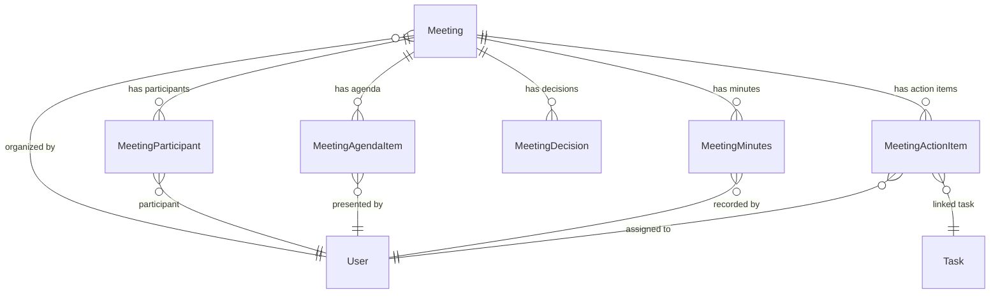
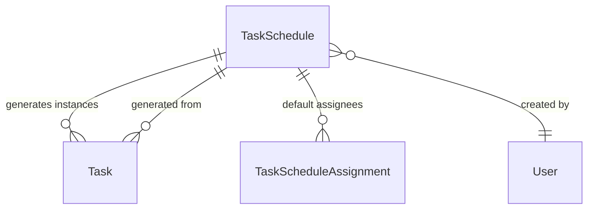
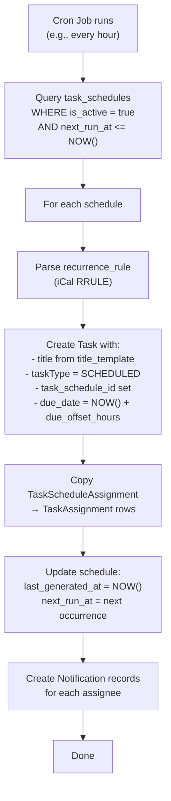
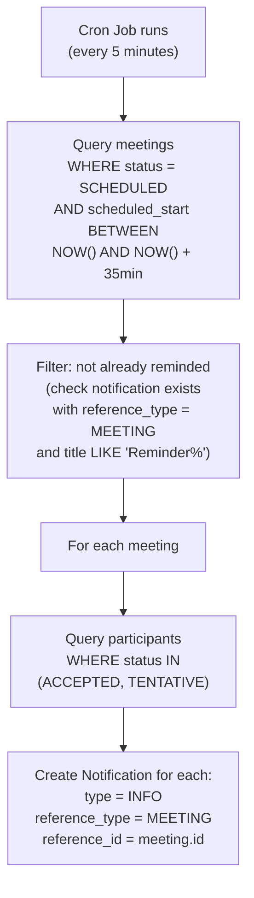

# Meeting Management & Scheduled Tasks — Implementation Plan

## 1. Overview

Two new features to be added to the Boblte ERP platform:

1. **Meeting Management Module** — Schedule meetings, manage participants, record agenda items, minutes, decisions, and action items. Action items link directly to the Task system for tracking.
2. **Scheduled/Recurring Tasks** — A proper `TaskSchedule` template model that defines recurrence patterns (weekly reports, monthly reviews, etc.) and auto-generates independent task instances on schedule.

Both features build on the existing schema architecture and the task schema redesign (`12-task-schema-redesign.md`).

---

## 2. Meeting Management Module

### 2.1 Architecture Diagram



### 2.2 Schema File

All meeting models will reside in a new file: `prisma/schema/meetings.prisma`

### 2.3 Enums

| Enum | Values | Purpose |
|------|--------|---------|
| `meeting_status` | `SCHEDULED`, `IN_PROGRESS`, `COMPLETED`, `CANCELLED`, `POSTPONED` | Meeting lifecycle |
| `meeting_type` | `REGULAR`, `ADHOC`, `RECURRING`, `REVIEW`, `STANDUP` | Categorization |
| `meeting_participant_role` | `ORGANIZER`, `CHAIRPERSON`, `SECRETARY`, `REQUIRED`, `OPTIONAL` | Role in the meeting |
| `meeting_participant_status` | `INVITED`, `ACCEPTED`, `DECLINED`, `TENTATIVE`, `ATTENDED`, `ABSENT` | RSVP & attendance tracking |
| `meeting_agenda_status` | `PENDING`, `DISCUSSED`, `DEFERRED`, `SKIPPED` | Per-agenda-item tracking |
| `meeting_action_status` | `OPEN`, `IN_PROGRESS`, `COMPLETED`, `CANCELLED` | Action item lifecycle |

### 2.4 Table Reference

#### `meetings`

| Column | Type | Constraints | Notes |
|--------|------|-------------|-------|
| id | uuid | PK | |
| tenant_id | uuid | FK → tenants (CASCADE) | |
| title | varchar | NOT NULL | Meeting subject |
| description | text | | Detailed description / purpose |
| meeting_type | meeting_type (enum) | DEFAULT 'REGULAR' | |
| status | meeting_status (enum) | DEFAULT 'SCHEDULED' | |
| location | varchar | | Physical location or room name |
| meeting_link | varchar | | Virtual meeting URL (Zoom, Teams, etc.) |
| scheduled_start | timestamptz | NOT NULL | |
| scheduled_end | timestamptz | NOT NULL | |
| actual_start | timestamptz | | When meeting actually started |
| actual_end | timestamptz | | When meeting actually ended |
| organized_by | uuid | FK → users | |
| meeting_schedule_id | uuid? | FK → meeting_schedules | Link to recurring schedule (if recurring) |
| custom_attributes | jsonb | DEFAULT '{}' | |
| audit fields | | | created_at/by, updated_at/by, deleted_at/by |

**Indexes**: `INDEX (tenant_id)`, `INDEX (tenant_id, status)`, `INDEX (tenant_id, scheduled_start)`, `INDEX (organized_by)`, `INDEX (meeting_schedule_id)`

---

#### `meeting_participants`

| Column | Type | Constraints | Notes |
|--------|------|-------------|-------|
| id | uuid | PK | |
| meeting_id | uuid | FK → meetings (CASCADE) | |
| user_id | uuid | FK → users | |
| role | meeting_participant_role (enum) | DEFAULT 'REQUIRED' | |
| status | meeting_participant_status (enum) | DEFAULT 'INVITED' | |
| rsvp_at | timestamptz | | When participant responded |
| attended_at | timestamptz | | Marked when participant actually joined |
| notes | text | | Participant-specific notes |

**Indexes**: `UNIQUE (meeting_id, user_id)`, `INDEX (user_id)`

---

#### `meeting_agenda_items`

| Column | Type | Constraints | Notes |
|--------|------|-------------|-------|
| id | uuid | PK | |
| meeting_id | uuid | FK → meetings (CASCADE) | |
| title | varchar | NOT NULL | Agenda topic |
| description | text | | Details |
| sort_order | int | DEFAULT 0 | Presentation sequence |
| duration_minutes | int | | Estimated time for this item |
| presenter_id | uuid? | FK → users | Who presents this item |
| status | meeting_agenda_status (enum) | DEFAULT 'PENDING' | |
| created_at | timestamptz | DEFAULT now() | |
| created_by | uuid? | | |

**Indexes**: `INDEX (meeting_id)`

---

#### `meeting_minutes`

Single record per meeting (or per agenda item if `agenda_item_id` is set). Captures what was discussed.

| Column | Type | Constraints | Notes |
|--------|------|-------------|-------|
| id | uuid | PK | |
| meeting_id | uuid | FK → meetings (CASCADE) | |
| agenda_item_id | uuid? | FK → meeting_agenda_items | Null = general minutes for the whole meeting |
| content | text | NOT NULL | The actual minutes text (Markdown) |
| recorded_by | uuid | FK → users | Who took the minutes |
| created_at | timestamptz | DEFAULT now() | |
| updated_at | timestamptz | ON UPDATE | |

**Indexes**: `INDEX (meeting_id)`, `INDEX (agenda_item_id)`

---

#### `meeting_decisions`

Formal decisions taken during the meeting.

| Column | Type | Constraints | Notes |
|--------|------|-------------|-------|
| id | uuid | PK | |
| meeting_id | uuid | FK → meetings (CASCADE) | |
| agenda_item_id | uuid? | FK → meeting_agenda_items | Which agenda item this decision relates to |
| decision_text | text | NOT NULL | The decision statement |
| decided_by | text | | Who made / agreed on the decision |
| created_at | timestamptz | DEFAULT now() | |
| created_by | uuid? | | |

**Indexes**: `INDEX (meeting_id)`

---

#### `meeting_action_items`

Action items arising from the meeting. **Linked to the Task system** for tracking.

| Column | Type | Constraints | Notes |
|--------|------|-------------|-------|
| id | uuid | PK | |
| meeting_id | uuid | FK → meetings (CASCADE) | |
| agenda_item_id | uuid? | FK → meeting_agenda_items | Which agenda item this came from |
| description | text | NOT NULL | What needs to be done |
| assigned_to_user_id | uuid? | FK → users | Direct user assignment |
| assigned_to_position_id | uuid? | FK → positions | Position-based assignment |
| due_date | timestamptz | | |
| status | meeting_action_status (enum) | DEFAULT 'OPEN' | |
| task_id | uuid? | FK → tasks | **Link to auto-created Task** |
| created_at | timestamptz | DEFAULT now() | |
| created_by | uuid? | | |

**Indexes**: `INDEX (meeting_id)`, `INDEX (assigned_to_user_id)`, `INDEX (task_id)`

> **Integration with Task system**: When an action item is created, the application layer auto-creates a corresponding `Task` (with `taskType = NORMAL`) and links it via `task_id`. The action item's status syncs bidirectionally with the linked task's status. This allows action items to appear in the assignee's regular task list alongside all other tasks.

---

### 2.5 Recurring Meetings

Recurring meetings (weekly standups, monthly reviews) use a `MeetingSchedule` template:

#### `meeting_schedules`

| Column | Type | Constraints | Notes |
|--------|------|-------------|-------|
| id | uuid | PK | |
| tenant_id | uuid | FK → tenants (CASCADE) | |
| title | varchar | NOT NULL | Template title |
| description | text | | |
| meeting_type | meeting_type (enum) | DEFAULT 'RECURRING' | |
| recurrence_rule | varchar | NOT NULL | iCal RRULE format (e.g., `FREQ=WEEKLY;BYDAY=MO;BYHOUR=10`) |
| duration_minutes | int | NOT NULL | How long each instance lasts |
| location | varchar | | Default location |
| meeting_link | varchar | | Default meeting link |
| organized_by | uuid | FK → users | |
| is_active | boolean | DEFAULT true | Pause/resume |
| starts_from | timestamptz | NOT NULL | When schedule begins |
| ends_at | timestamptz | | When schedule ends (null = indefinite) |
| last_generated_at | timestamptz | | Last time an instance was auto-created |
| custom_attributes | jsonb | DEFAULT '{}' | |
| audit fields | | | created_at/by, updated_at/by, deleted_at/by |

**Indexes**: `INDEX (tenant_id)`, `INDEX (tenant_id, is_active)`

**How it works**:
1. A cron job runs (e.g., daily) and queries all active `MeetingSchedule` records
2. For each schedule, it parses the `recurrence_rule` (iCal RRULE) to determine the next occurrence(s)
3. Creates `Meeting` instances with `meeting_schedule_id` linking back to the schedule
4. Copies the default participant list from a `MeetingScheduleParticipant` table

#### `meeting_schedule_participants`

Default participants for recurring meeting instances.

| Column | Type | Constraints | Notes |
|--------|------|-------------|-------|
| id | uuid | PK | |
| meeting_schedule_id | uuid | FK → meeting_schedules (CASCADE) | |
| user_id | uuid | FK → users | |
| role | meeting_participant_role (enum) | DEFAULT 'REQUIRED' | |

**Indexes**: `UNIQUE (meeting_schedule_id, user_id)`

---

## 3. Scheduled / Recurring Tasks

### 3.1 Problem with Current Design

The existing `TaskFrequency` enum (`DAILY`, `WEEKLY`, `MONTHLY`, `YEARLY`) on the `Task` model is a simple label — it doesn't define *when* to generate, *what* to generate, or *who* to assign. It has no mechanism to:

- Define the exact schedule (e.g., "every Monday at 9am" vs "every 15th of the month")
- Auto-create task instances with pre-configured title, description, assignees
- Pause/resume the schedule
- Set a start/end range
- Track what was already generated

### 3.2 Solution: `TaskSchedule` Template Model

A separate `TaskSchedule` model acts as a **template** that defines what task to create and when:



### 3.3 Table Reference

#### `task_schedules`

| Column | Type | Constraints | Notes |
|--------|------|-------------|-------|
| id | uuid | PK | |
| tenant_id | uuid | FK → tenants (CASCADE) | |
| title_template | varchar | NOT NULL | Task title (supports variables like `{month}`, `{week}`) |
| description_template | text | | Task description template |
| recurrence_rule | varchar | NOT NULL | iCal RRULE format |
| priority | task_priority (enum) | DEFAULT 'MEDIUM' | Default priority for generated tasks |
| due_offset_hours | int | DEFAULT 0 | Hours after generation to set as due date |
| is_active | boolean | DEFAULT true | Pause/resume |
| starts_from | timestamptz | NOT NULL | When schedule begins |
| ends_at | timestamptz | | When schedule ends (null = indefinite) |
| last_generated_at | timestamptz | | Last instance creation timestamp |
| next_run_at | timestamptz | | Pre-computed next generation time |
| custom_attributes | jsonb | DEFAULT '{}' | Copied to each generated task |
| audit fields | | | created_at/by, updated_at/by, deleted_at/by |

**Indexes**: `INDEX (tenant_id)`, `INDEX (tenant_id, is_active)`, `INDEX (next_run_at)`

---

#### `task_schedule_assignments`

Default assignees for generated task instances.

| Column | Type | Constraints | Notes |
|--------|------|-------------|-------|
| id | uuid | PK | |
| task_schedule_id | uuid | FK → task_schedules (CASCADE) | |
| assignee_type | task_assignee_type (enum) | NOT NULL | `USER` or `POSITION` |
| assignee_user_id | uuid? | FK → users | |
| assignee_position_id | uuid? | FK → positions | |

**Indexes**: `UNIQUE (task_schedule_id, assignee_user_id)`, `UNIQUE (task_schedule_id, assignee_position_id)`

---

### 3.4 Link from Task to TaskSchedule

Add a `task_schedule_id` column to the `tasks` table:

| Column | Type | Constraints | Notes |
|--------|------|-------------|-------|
| task_schedule_id | uuid? | FK → task_schedules | Links generated task back to its schedule template |

**Index**: `INDEX (task_schedule_id)`

### 3.5 Update to `TaskType` Enum

```diff
 enum TaskType {
   NORMAL
   WORKFLOW
+  SCHEDULED    // Auto-generated from a TaskSchedule

   @@map("task_type")
 }
```

### 3.6 Auto-Generation Logic (Application Layer)



### 3.7 Template Variable Support

The `title_template` field supports variables that are resolved at generation time:

| Variable | Resolves To | Example |
|----------|-------------|---------|
| `{date}` | Generation date (YYYY-MM-DD) | `2026-06-18` |
| `{month}` | Full month name | `June` |
| `{month_short}` | Abbreviated month | `Jun` |
| `{year}` | Four-digit year | `2026` |
| `{week}` | ISO week number | `25` |
| `{day}` | Day of month | `18` |
| `{day_name}` | Day of week | `Thursday` |

**Examples**:
- Template: `Monthly Finance Report - {month} {year}` → `Monthly Finance Report - June 2026`
- Template: `Weekly Standup Summary - Week {week}` → `Weekly Standup Summary - Week 25`
- Template: `Daily Attendance Audit - {date}` → `Daily Attendance Audit - 2026-06-18`

### 3.8 Recurrence Rule Examples (iCal RRULE)

| Schedule | RRULE |
|----------|-------|
| Every Monday at 9am | `FREQ=WEEKLY;BYDAY=MO;BYHOUR=9` |
| 1st of every month | `FREQ=MONTHLY;BYMONTHDAY=1` |
| Every weekday | `FREQ=WEEKLY;BYDAY=MO,TU,WE,TH,FR` |
| Quarterly (Jan, Apr, Jul, Oct 1st) | `FREQ=YEARLY;BYMONTH=1,4,7,10;BYMONTHDAY=1` |
| Every 2 weeks on Friday | `FREQ=WEEKLY;INTERVAL=2;BYDAY=FR` |
| Yearly on March 31 | `FREQ=YEARLY;BYMONTH=3;BYMONTHDAY=31` |

> We recommend the npm package `rrule` for parsing and generating occurrences from RRULE strings.

---

## 4. Impact on Existing Schemas

### 4.1 `tasks.prisma`

| Change | Details |
|--------|---------|
| Add `task_schedule_id` column | FK → task_schedules, nullable |
| Add `SCHEDULED` to `TaskType` enum | New value for auto-generated tasks |
| Add `taskSchedule` relation | `TaskSchedule? @relation(...)` |
| Remove `frequency` field | Replaced by `TaskSchedule.recurrence_rule` |

### 4.2 `auth.prisma` — `User` Model

Add reverse relations:
```
meetingsOrganized             Meeting[]                @relation("MeetingOrganizer")
meetingParticipations         MeetingParticipant[]     @relation("MeetingParticipantUser")
meetingAgendaPresenting       MeetingAgendaItem[]      @relation("MeetingAgendaPresenter")
meetingMinutesRecorded        MeetingMinutes[]         @relation("MeetingMinutesRecorder")
meetingActionItemsAssigned    MeetingActionItem[]      @relation("MeetingActionItemAssignee")
meetingSchedulesOrganized     MeetingSchedule[]        @relation("MeetingScheduleOrganizer")
```

### 4.3 `org.prisma` — `Position` Model

Add reverse relation:
```
meetingActionItems            MeetingActionItem[]      @relation("MeetingActionItemPosition")
```

### 4.4 `platform.prisma` — `Tenant` Model

Add reverse relations:
```
meetings                      Meeting[]
meetingSchedules              MeetingSchedule[]
taskSchedules                 TaskSchedule[]
```

---

## 5. Permissions

### 5.1 Meeting Permissions

| Permission | Description |
|------------|-------------|
| `meetings:create` | Create / schedule a meeting |
| `meetings:view_all` | View all meetings in the tenant |
| `meetings:view_own` | View meetings where user is participant or organizer |
| `meetings:edit` | Edit meeting details |
| `meetings:delete` | Soft-delete meetings |
| `meetings:manage_participants` | Add/remove participants |
| `meetings:manage_agenda` | Add/edit/remove agenda items |
| `meetings:record_minutes` | Add/edit meeting minutes |
| `meetings:manage_decisions` | Record decisions |
| `meetings:manage_actions` | Create/edit action items |

### 5.2 Task Schedule Permissions

| Permission | Description |
|------------|-------------|
| `task_schedules:create` | Create a recurring task schedule |
| `task_schedules:view_all` | View all schedules in the tenant |
| `task_schedules:edit` | Edit schedule template, recurrence, assignees |
| `task_schedules:delete` | Soft-delete a schedule |
| `task_schedules:pause_resume` | Activate/deactivate a schedule |

---

## 6. Notification Integration

All notifications use the existing `Notification` model in `system.prisma`. The polymorphic `reference_type` + `reference_id` columns link each notification to the source entity.

### 6.1 Reference Type Registry

New `referenceType` values to be used in the `notifications` table:

| `reference_type` | `reference_id` points to | Module |
|------------------|-------------------------|--------|
| `MEETING` | `meetings.id` | Meetings |
| `MEETING_SCHEDULE` | `meeting_schedules.id` | Meetings |
| `MEETING_ACTION_ITEM` | `meeting_action_items.id` | Meetings |
| `TASK_SCHEDULE` | `task_schedules.id` | Tasks |
| `TASK` | `tasks.id` | Tasks (existing) |

### 6.2 Meeting Notifications

| Trigger Event | Recipients | `type` | `title` (template) | `reference_type` |
|---------------|-----------|--------|---------------------|-----------------|
| Meeting created/scheduled | All participants | `ACTION_REQUIRED` | "You've been invited to: {meeting.title}" | `MEETING` |
| Participant added to existing meeting | Added participant | `ACTION_REQUIRED` | "You've been added to: {meeting.title}" | `MEETING` |
| Meeting cancelled | All participants | `WARNING` | "Meeting cancelled: {meeting.title}" | `MEETING` |
| Meeting postponed | All participants | `WARNING` | "Meeting rescheduled: {meeting.title}" | `MEETING` |
| Meeting reminder (T−30 min) | Accepted participants | `INFO` | "Reminder: {meeting.title} starts in 30 minutes" | `MEETING` |
| Meeting status → COMPLETED | All participants | `INFO` | "Meeting completed: {meeting.title}" | `MEETING` |
| Minutes published | All participants | `INFO` | "Minutes available for: {meeting.title}" | `MEETING` |
| Action item created | Assigned user / position holder | `ACTION_REQUIRED` | "New action item from: {meeting.title}" | `MEETING_ACTION_ITEM` |
| RSVP declined by participant | Organizer | `INFO` | "{user.name} declined: {meeting.title}" | `MEETING` |

### 6.3 Recurring Meeting Notifications

| Trigger Event | Recipients | `type` | `title` (template) | `reference_type` |
|---------------|-----------|--------|---------------------|-----------------|
| Recurring meeting instance generated | All default participants | `ACTION_REQUIRED` | "Upcoming: {meeting.title} on {date}" | `MEETING` |
| Meeting schedule paused | Organizer | `INFO` | "Recurring meeting paused: {schedule.title}" | `MEETING_SCHEDULE` |
| Meeting schedule resumed | Organizer + participants | `INFO` | "Recurring meeting resumed: {schedule.title}" | `MEETING_SCHEDULE` |

### 6.4 Scheduled Task Notifications

| Trigger Event | Recipients | `type` | `title` (template) | `reference_type` |
|---------------|-----------|--------|---------------------|-----------------|
| Scheduled task instance generated | All assignees (resolved from TaskScheduleAssignment) | `ACTION_REQUIRED` | "New scheduled task: {task.title}" | `TASK` |
| Task schedule paused | Schedule creator | `INFO` | "Task schedule paused: {schedule.title_template}" | `TASK_SCHEDULE` |
| Task schedule resumed | Schedule creator | `INFO` | "Task schedule resumed: {schedule.title_template}" | `TASK_SCHEDULE` |
| Task schedule ends (reaches `ends_at`) | Schedule creator | `INFO` | "Task schedule completed: {schedule.title_template}" | `TASK_SCHEDULE` |

### 6.5 Meeting Reminder Implementation

Meeting reminders require a scheduled job that runs periodically:



> **Alternative**: Add a `reminder_sent_at` column to `meetings` to avoid the duplicate-check query. This is simpler but adds a column.

### 6.6 Notification Generation Pattern (Application Layer)

All notification creation follows a consistent service pattern:

```typescript
// Example: Meeting scheduled notification
await notificationService.createBulk({
  tenantId: meeting.tenantId,
  recipientIds: participantUserIds,
  title: `You've been invited to: ${meeting.title}`,
  body: `Scheduled for ${formatDate(meeting.scheduledStart)}`,
  type: NotificationType.ACTION_REQUIRED,
  referenceType: 'MEETING',
  referenceId: meeting.id,
  createdBy: meeting.organizedBy,
});
```

The `createBulk` method creates one `Notification` row per recipient. The frontend resolves `referenceType` + `referenceId` to build deep links (e.g., `/meetings/{id}`, `/tasks/{id}`).

---

## 7. API Endpoints (Summary)

### 7.1 Meeting APIs

| Method | Endpoint | Description |
|--------|----------|-------------|
| POST | `/meetings` | Create/schedule meeting |
| GET | `/meetings` | List meetings (filterable) |
| GET | `/meetings/my` | My meetings (participant/organizer) |
| GET | `/meetings/:id` | Get meeting detail |
| PATCH | `/meetings/:id` | Update meeting |
| DELETE | `/meetings/:id` | Soft-delete meeting |
| PATCH | `/meetings/:id/status` | Change meeting status |
| POST | `/meetings/:id/participants` | Add participants |
| PATCH | `/meetings/:id/participants/:pid` | Update RSVP/attendance |
| DELETE | `/meetings/:id/participants/:pid` | Remove participant |
| POST | `/meetings/:id/agenda` | Add agenda item |
| PATCH | `/meetings/:id/agenda/:aid` | Update agenda item |
| DELETE | `/meetings/:id/agenda/:aid` | Remove agenda item |
| POST | `/meetings/:id/minutes` | Record minutes |
| PATCH | `/meetings/:id/minutes/:mid` | Update minutes |
| POST | `/meetings/:id/decisions` | Record decision |
| POST | `/meetings/:id/actions` | Create action item (auto-creates task) |
| PATCH | `/meetings/:id/actions/:aid` | Update action item |

### 7.2 Meeting Schedule APIs

| Method | Endpoint | Description |
|--------|----------|-------------|
| POST | `/meeting-schedules` | Create recurring meeting schedule |
| GET | `/meeting-schedules` | List schedules |
| GET | `/meeting-schedules/:id` | Get schedule detail |
| PATCH | `/meeting-schedules/:id` | Update schedule |
| DELETE | `/meeting-schedules/:id` | Soft-delete schedule |
| PATCH | `/meeting-schedules/:id/activate` | Activate/deactivate |

### 7.3 Task Schedule APIs

| Method | Endpoint | Description |
|--------|----------|-------------|
| POST | `/task-schedules` | Create recurring task schedule |
| GET | `/task-schedules` | List schedules |
| GET | `/task-schedules/:id` | Get schedule detail with generated tasks |
| PATCH | `/task-schedules/:id` | Update schedule template |
| DELETE | `/task-schedules/:id` | Soft-delete schedule |
| PATCH | `/task-schedules/:id/activate` | Activate/deactivate |

---

## 8. User Review Required

> [!IMPORTANT]
> **Meeting ↔ Task integration**: When a meeting action item is created, should the system auto-create a `Task` immediately? Or should it be a manual "Convert to Task" button on the UI? Auto-creation ensures nothing falls through the cracks, but may create unwanted tasks.

> [!WARNING]
> **TaskFrequency removal**: The current `frequency` field on `Task` will be deprecated in favor of `TaskSchedule`. If any existing code reads `task.frequency`, it needs to be migrated. The field can be retained temporarily as `@deprecated` until all code is updated.

## 9. Resolved Questions

| # | Question | Decision |
|---|----------|----------|
| 1 | Meeting attachments? | ❌ **Not needed** — No file attachments for meetings in this phase |
| 2 | Calendar integration (.ics)? | ⏳ **Deferred** — Will incorporate at a later stage |
| 3 | Recurrence rule format? | ✅ **iCal RRULE** — Using standard iCal RRULE format with the `rrule` npm package |
| 4 | TaskSchedule default collaborators/watchers? | ❌ **Not needed** — No default collaborator/watcher list on TaskSchedule |
| 5 | Meeting ↔ Workflow integration? | ❌ **Not needed** — Meetings will not be triggerable by workflows |

---

## 10. Verification Plan

### Automated Tests
```bash
npx prisma validate
npx prisma generate
```

### Manual Verification
- Review generated SQL migration for correctness
- Verify all relation names resolve without conflicts across schema files
- Confirm index coverage for common query patterns (meetings by user, meetings by date, scheduled tasks by tenant)
- Test RRULE parsing and occurrence generation with edge cases (DST transitions, leap years, month-end)
